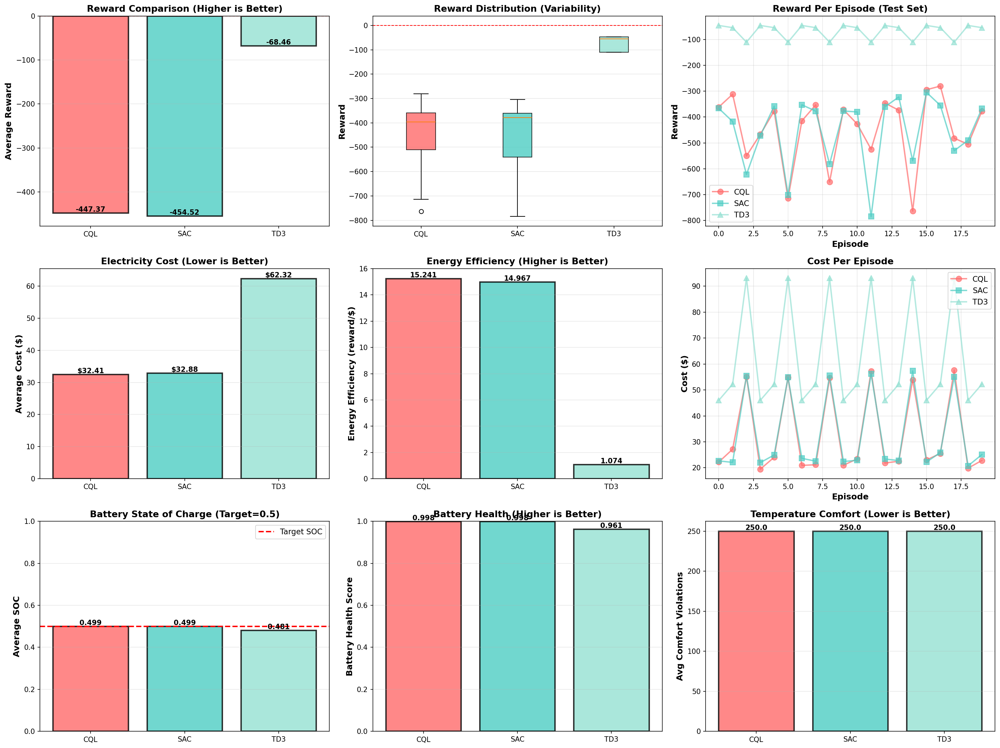

# Gestion énergétique d'un bâtiment par apprentissage par renforcement

Étude comparative d'agents d'**apprentissage par renforcement hors ligne et en ligne** (CQL, SAC, TD3) qui pilotent à la fois le **chauffage/climatisation (HVAC)** et une **batterie domestique** d'un bâtiment simulé sous **EnergyPlus**, avec un tarif d'électricité heures pleines / heures creuses et une production photovoltaïque.

L'objectif : réduire la facture d'électricité en jouant sur la batterie et les consignes de température, sans sacrifier le confort des occupants ni user la batterie.



---

## Le problème

Un bâtiment de 5 zones (modèle `5ZoneAutoDXVAV` de Sinergym, climat chaud, Arizona) est étendu par un wrapper Gymnasium maison, [`BuildingBatteryEnv`](src/environments/building_env_wrappers.py) :

| Composant | Modèle |
|---|---|
| **Batterie** | 10 kWh, ±5 kW, rendement 90 %, état de charge (SOC) borné entre 20 % et 90 % |
| **Tarif dynamique** | Heures pleines 7 h–22 h : 0,25 €/kWh · heures creuses : 0,10 €/kWh · revente au réseau à 50 % |
| **Photovoltaïque** | 5 kWc, rendement 20 %, calculé à partir de l'irradiance météo |
| **Observation** | Variables Sinergym (météo, températures, puissance) + SOC de la batterie |
| **Action** | Consignes HVAC (chauffage, refroidissement) + puissance batterie ∈ [-1, 1] |

**Récompense multi-objectif :**

```
r = − coût_électricité − λ_confort · pénalité_confort − λ_batterie · pénalité_cyclage
```

La pénalité de confort est quadratique hors de la plage 21–25 °C, et la pénalité de cyclage limite les charges/décharges inutiles qui dégradent la batterie.

## Démarche en 3 phases

1. **Infrastructure reproductible.** Image Docker Ubuntu 24.04 avec EnergyPlus 24.2 et Sinergym 3.10, prête pour VS Code Dev Containers. Un correctif ([`sinergym_fix.py`](src/utils/sinergym_fix.py)) contourne un bug d'installation de `pyenergyplus`.
2. **Environnement.** Diagnostic de Sinergym, développement du wrapper batterie, tarification et PV, puis nettoyage automatique des sorties de simulation.
3. **Apprentissage et évaluation.**
   - **3A. Jeu de données hors ligne** : 200 épisodes, soit **50 000 transitions**, collectés avec un mélange de politiques (aléatoire, à règles, « expert »).
   - **3B. CQL hors ligne** : *Conservative Q-Learning* (Kumar et al., 2020) avec double Q-learning, entraîné 500 époques sur le jeu de données, sans aucune interaction avec l'environnement.
   - **3C. SAC et TD3 en ligne** : entraînés en interaction directe avec la simulation.
   - **3D. Évaluation finale** : 20 épisodes de test par agent, 9 indicateurs comparés.

Une **politique à règles** sert de référence : charger la batterie en heures creuses, la décharger en heures pleines, et corriger les consignes quand la température sort de la zone de confort.

## Résultats

Évaluation sur 20 épisodes ([`phase_3d_final_comparison.csv`](results/phase_3d_final_comparison.csv)) :

| Agent | Type | Récompense moy. | Coût moy. / épisode | SOC moyen | Santé batterie |
|---|---|---:|---:|---:|---:|
| **CQL** | Hors ligne | −447,4 | **32,41 $** | 0,499 | **0,998** |
| **SAC** | En ligne | −454,5 | 32,88 $ | 0,499 | 0,998 |
| **TD3** | En ligne | **−68,5** | 62,32 $ | 0,481 | 0,961 |

**Lecture :**
- **CQL, appris uniquement sur des données historiques, obtient la facture la plus basse** et préserve le mieux la batterie. C'est l'intérêt du RL hors ligne : on apprend une politique sûre sans expérimenter sur un vrai bâtiment.
- **TD3 obtient de loin la meilleure récompense, mais une facture presque deux fois plus élevée** et une batterie plus sollicitée. Récompense et coût réel divergent donc : la fonction de récompense (pondérations λ, échelle du terme de coût) ne reflète pas assez fidèlement l'objectif économique. C'est le premier axe d'amélioration.
- SAC se comporte de façon très proche de CQL, avec une variance similaire.
- L'indicateur de violations de confort est saturé (250 pas sur 250 pour tous les agents). La mesure de confort est à revoir dans une suite du projet.

Les courbes d'apprentissage sont dans [`results/figures/`](results/figures/) et les journaux dans [`results/logs/`](results/logs/).

## Structure

```
├── src/
│   ├── environments/building_env_wrappers.py   # Wrapper batterie + tarif + PV + récompense
│   ├── algorithms/
│   │   ├── cql.py                  # Conservative Q-Learning (hors ligne)
│   │   ├── sac.py                  # Soft Actor-Critic (en ligne)
│   │   ├── td3.py                  # Twin Delayed DDPG (en ligne)
│   │   ├── offline_replay_buffer.py
│   │   └── policies_helper.py      # Politique à règles et mélange de politiques
│   ├── utils/sinergym_fix.py
│   └── config.py                   # Chemins et configuration centralisée
├── notebooks/                      # Phases 3A → 3D, pas à pas
├── results/
│   ├── checkpoints/                # Poids entraînés : cql_agent.pt, sac_agent.pt, td3_agent.pt
│   ├── figures/                    # Graphiques de chaque phase
│   └── logs/                       # Journaux d'entraînement et rapport final
├── run_experiments.py              # Orchestration complète de l'évaluation (phase 3D)
├── Dockerfile · .devcontainer/     # Environnement EnergyPlus + Sinergym reproductible
└── requirements.txt
```

## Lancer le projet

**Prérequis :** Docker et VS Code avec l'extension *Dev Containers*.

```bash
git clone https://github.com/adononcarlos/Energy-Management-by-RL.git
cd Energy-Management-by-RL
code .   # puis « Reopen in Container » (premier build : ~10 min)
```

Dans le conteneur :

```bash
python run_experiments.py      # évalue CQL, SAC et TD3 à partir des checkpoints fournis
```

Pour tout reproduire depuis zéro, exécutez les notebooks dans l'ordre : `phase_3a` (jeu de données), `phase_3b` (CQL), `phase_3c` (SAC/TD3), puis `phase_3d` (évaluation).

## Stack

Python 3.12 · PyTorch · Gymnasium · Sinergym 3.10 · EnergyPlus 24.2 · NumPy / Pandas · Matplotlib / Seaborn · Docker

## Licence

MIT
